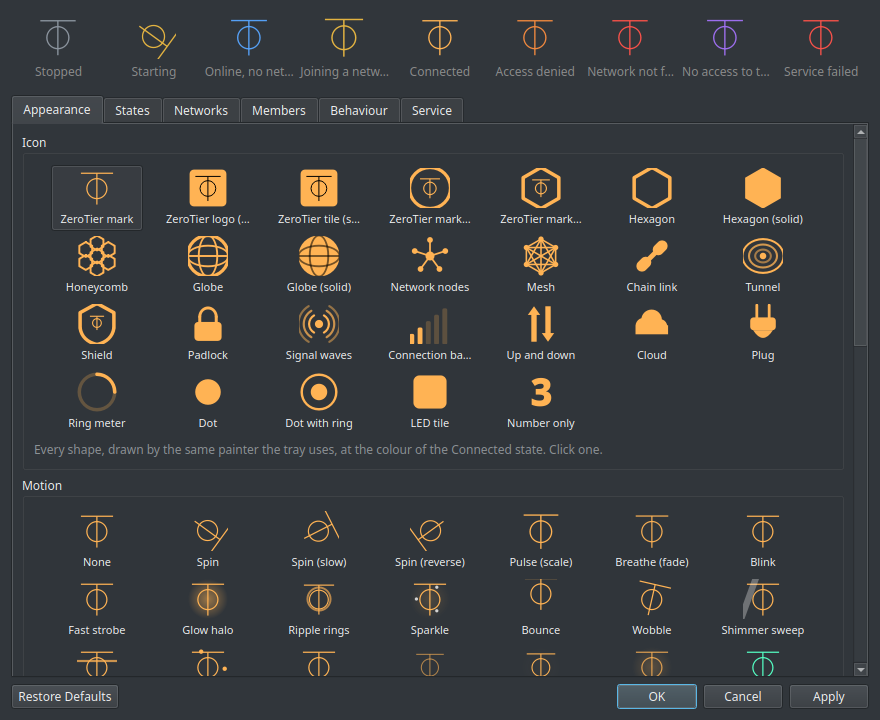

# ZeroTier GUI Tray Icon KDE

Run **ZeroTier One** from the system tray. Join and leave networks, see the
address you were given, watch who else is on it and how far away they are, flip
the per-network switches, start the service and open its ports — without a
terminal. Built for KDE Plasma, works anywhere there is a tray.


> **Not affiliated with ZeroTier, Inc.** — an independent front end, not made,
> endorsed or supported by them. ZeroTier is their trademark; the mark appears
> here only to name the daemon this controls. Bugs in **this tray** belong in
> this repository, never in theirs.

## Install

```sh
curl -fsSL https://raw.githubusercontent.com/gabrielmf1998/ZeroTier-GUI-KDE/main/install-online.sh | sh
```

Picks the right package, installs `zerotier-one` first if it is missing, and
starts it. The same line upgrades an existing install. Or take a package from
[Releases](https://github.com/gabrielmf1998/ZeroTier-GUI-KDE/releases/latest):

| Distro | Command |
|---|---|
| Fedora / RHEL | `sudo dnf install ./zerotier-tray-kde-1.0.3-1.fc46.noarch.rpm` |
| Arch / CachyOS / Manjaro | `sudo pacman -U zerotier-tray-kde-1.0.3-1-any.pkg.tar.zst` |
| Debian / Ubuntu | `sudo apt install ./zerotier-tray-kde_1.0.3-1_all.deb` |
| anything else | `chmod +x ZeroTier-Tray-KDE-x86_64.AppImage && ./ZeroTier-Tray-KDE-x86_64.AppImage` |

Needs `python3`, `PySide6`, `polkit` and `zerotier-one`. That last one is a hard
dependency — a tray for a daemon that is not there is useless. Arch has it in
`extra`; Fedora in RPM Fusion nonfree; Debian and Ubuntu do not package it at
all, which is why the installer falls back to ZeroTier's own signed installer
and says so before it runs it.

Then launch **ZeroTier Tray**, and pick **Grant access to ZeroTier** once so it
stops asking for a password.

## What it does

Right-click the icon:

- **your address**, and your public address, each one click to copy
- **join** a network by ID, **leave** one you are on
- **members** — everyone else on the network, with their address, node ID,
  latency, and whether the path is direct or relayed
- the four per-network switches (`allowManaged`, `allowGlobal`, `allowDefault`,
  `allowDNS`)
- start, stop, restart, **start with the system**, and a checkbox that allows
  ZeroTier's UDP ports in a firewalld zone

Everything on screen comes from `zerotier-one`'s own API on `127.0.0.1`. The
only request that ever leaves the machine is **Check for updates**, and only
when you press it.

## Choosing how it looks

26 icon styles and 21 animations, a colour and an animation per state — and you
pick them by looking, not by reading a dropdown. Every shape is drawn by the
same painter the tray uses; every animation is actually moving. All nine states
sit above the tabs, exactly as the tray will draw them.



Two of the styles are ZeroTier's own mark. Upstream says it plainly in
`artwork/logo.html` — *"Yes, our logo is a Unicode character."* — U+23C1 ⏁ on
`#ffb354`, drawn here as geometry so it needs no font. The other 24 carry no
ZeroTier branding at all.

## Who else is on the network

ZeroTier's local API lists peers globally and never says which network they
belong to — that lives on the controller, which a member cannot query. So the
tray works it out: every node gets a **deterministic MAC** on a network, derived
from the network ID and the node ID (`MAC::fromAddress` upstream). Compute it,
look it up in the kernel neighbour table for the `zt…` interface, and a hit both
proves the peer is on that network and hands over their address.

A peer only lands in that table once it has exchanged a packet with you, so
**Scan the subnet for members** pings the range you were assigned to bring them
all in at once. When only one network is joined, every non-root peer must be on
it, so they are listed too.

## What needs root

Four things, all through one small polkit helper:

| Action | Why |
|---|---|
| start / stop / restart | it is a system unit |
| start with the system | `systemctl enable` |
| allow the UDP ports | `firewall-cmd` |
| grant / revoke the API token | reading a root-only file |

Granting puts a copy of the service token in `~/.config/zerotier-tray/`, mode
`0600` — the same thing `man zerotier-cli` recommends, and the same real
permission: anyone who can read your home directory could then attach this
machine to any ZeroTier network. The Service tab takes it back.

The helper validates everything it is handed: the user must be a real
unprivileged account, the zone one firewalld already knows, a network ID
sixteen hex digits. The ports it opens are read out of the running service, never
taken from the caller.

## Notes

- **No tray icon yet?** Panels publish theirs some time after login, so an app
  started first can beat them to it. This one waits and appears on its own; it
  will not quit on you.
- **Stopping the service.** `zerotier-one` sometimes dies with `SIGSEGV` on its
  way down. The daemon does stop, so the helper clears the failed state — but
  only for a death by signal or timeout. A unit that failed to *start* stays
  visibly failed, and the tray says what happened either way.
- Settings live in `~/.config/zerotier-tray/config.json`.

## Licence

MIT. ZeroTier One itself is a separate project under its own licence — see
[zerotier.com](https://www.zerotier.com/).
