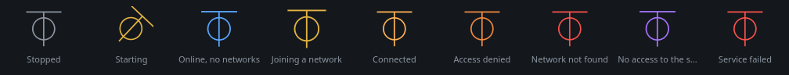
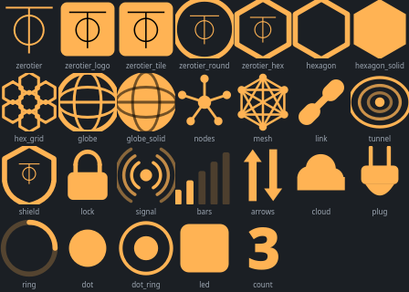
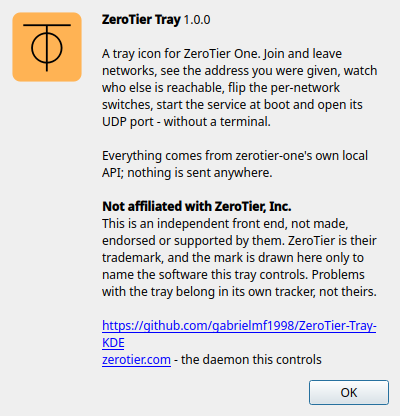

# ZeroTier Tray

An **unofficial, non-affiliated** system tray GUI for **ZeroTier One**, built
for KDE Plasma and working on any desktop with a system tray. Join and leave
networks, see the address the controller gave you, watch who else is reachable
and how far away they are, flip the per-network switches, start the service,
keep it across reboots and open its UDP ports in the firewall — without opening
a terminal.



> **Not affiliated with ZeroTier, Inc.**
> This is an independent third-party front end. It is not made, endorsed,
> reviewed or supported by ZeroTier, Inc. ZeroTier is their trademark; the mark
> is drawn here only to identify the software this tray controls. For the
> daemon itself, and for anything that goes wrong inside it, go to
> [zerotier.com](https://www.zerotier.com/). Bugs in **this tray** belong in
> this repository's issues, never theirs.

It drives `zerotier-one`; it does not replace it. Every package here depends on
`zerotier-one`, and the one-line installer puts it in for you if it is missing.

## Why

ZeroTier ships a daemon and `zerotier-cli`, and nothing else. Every ordinary
thing — *am I connected? what is my address? who else is on this network? why
is this peer being relayed?* — is a `sudo zerotier-cli` away, and the answers
come back as JSON or as a table you have to read. There is no icon telling you
the link is up, and no way to notice from the corner of your eye that it went
down.

Everything on screen here comes from zerotier-one's own local API on
`127.0.0.1`. Nothing is invented and nothing is sent anywhere.

## What it shows

| State | When |
|---|---|
| Stopped | `zerotier-one` is not running |
| Starting | running, but no root server has answered yet |
| Online, no networks | the node is online and has joined nothing |
| Joining a network | waiting for the controller to answer |
| Connected | at least one network is `OK` |
| Access denied | the controller has not authorised this machine |
| Network not found | a joined network ID does not exist |
| No access to the service | the tray cannot read the API token |
| Service failed | the unit is in `failed` |

Every state has its own colour **and** its own animation.

## My IP

The first thing anyone opens a VPN tray for. It sits at the top of the menu,
not buried in a submenu, and every line copies itself when clicked:

```
Node cc19675e38                (click to copy)
IP 10.167.181.170              (click to copy)
Public IP 45.237.111.105       (click to copy)
My addresses ▸
    ZeroTier
        10.167.181.170  ·  Amigos Windows/Linux  ·  /24
    Public
        45.237.111.105
        2804:1530:4dd:cf00:7088:3406:bb4d:6d07  ·  IPv6
    This machine
        192.168.0.155  ·  enp7s0
    Copy every address
```

The public address is not looked up anywhere: it is the surface address
ZeroTier's own root servers report seeing you at, which the daemon already
publishes in `/status`. The local one is `ip route get` — the source address
the routing table would actually pick, which is the one ZeroTier binds on.
Same list, with a Copy button per row, on the Service tab.

## What it does

Right-click gives you, per joined network:

- the addresses the controller assigned, click to copy
- the network ID and the interface, MTU and type
- **Members** — everyone else zerotier-one can see, with their address on the
  network, their node ID, latency, and whether the path is direct or relayed
- the four per-network switches (`allowManaged`, `allowGlobal`, `allowDefault`,
  `allowDNS`) — the same ones as `zerotier-cli set <network> allowX=`
- leave the network

and, for the service itself: start, stop, restart, start with the system, and a
checkbox that allows ZeroTier's UDP ports in a firewalld zone.


## Who else is connected

This is the part ZeroTier makes awkward, so it is worth being precise about.

The local API lists **VL1 peers** — every node this daemon has talked to
recently — globally, not per network. It never says which network a peer belongs
to; that lives on the controller, which a plain member cannot query. So the tray
attributes peers to a network two ways:

- **Proven.** ZeroTier gives every node a deterministic MAC on a network,
  derived from the network ID and the 40-bit node ID (`MAC::fromAddress`
  upstream). The tray computes that MAC for each peer and looks it up in the
  kernel neighbour table for the `zt…` interface. A hit is proof the peer is on
  that network, and it hands over their **managed IP address** as a bonus.
- **Inferred.** When exactly one network is joined, every non-root leaf peer
  must be on it, so they are listed too — without an address until they show up
  in the neighbour table.

A member only lands in the neighbour table after it has actually exchanged a
packet with this machine. **Scan the subnet for members** pings the /24 you were
assigned so they all appear at once; it touches nothing but your own virtual
network.

ZeroTier's own roots and the network controller are hidden by default — they are
infrastructure, not people. There is a checkbox to show them.

## Root, and how little of it is needed

`zerotier-one` keeps its API token in `/var/lib/zerotier-one/authtoken.secret`,
mode `0600`, owned by root. Without it the tray can see nothing.

**Grant access to this user** (menu, or the Service tab) puts a copy in
`~/.config/zerotier-tray/authtoken.secret`, `0600`, owned by you. From then on
the live view, joining, leaving and the per-network switches all work with no
password at all. This is the same thing `man zerotier-cli` recommends, and the
same real permission: anyone who can read your home directory could then connect
this machine to any ZeroTier network. The Service tab can take it away again.

Four things still need root, and they go through one small helper launched by
`pkexec`:

| Action | Why |
|---|---|
| start / stop / restart | it is a system unit |
| start with the system | `systemctl enable` |
| allow the UDP ports | `firewall-cmd` |
| grant / revoke the token | reading a root-only file |

The helper (`/usr/libexec/zerotier-tray-helper`) validates everything it is
given: the user must be a real unprivileged local account, the zone must be one
firewalld already knows, a network ID must be sixteen hex digits. The ports it
opens are never taken from the caller — it reads them back out of the running
service. When it writes into your home directory it drops to your uid first, so
root never follows a path you control.

## The firewall button

ZeroTier still works behind a closed firewall, by relaying through a root
server — which costs latency, every packet, both ways. Letting its UDP ports in
on the zone that holds your real network card lets peers reach you directly.

The tray reads the three ports the daemon actually holds (primary, secondary and
tertiary — the last two are derived from your identity, so they are not 9993)
and opens exactly those, permanently and at once, in the zone you pick. By
default that is firewalld's default zone, which is the one your physical
interface lives in. Opening ports on the `zt…` interface's own zone would do
nothing: the traffic arrives on the physical link.

## Icons

26 styles, 21 animations, a colour and an animation per state, and an optional
count badge.



Two of them are ZeroTier's own mark. Upstream's `artwork/logo.html` says it
plainly — *"Yes, our logo is a Unicode character. It sort of just turned out
that way."* — it is U+23C1 ⏁ in black on `#ffb354`. Both are drawn here as
geometry rather than text, so they never depend on an installed font.

- **ZeroTier logo (official colours)** keeps the orange tile exactly as
  upstream draws it, and shows the state as a corner dot instead.
- **ZeroTier mark** is the same glyph, tinted with the state colour.

The mark is used only to identify the daemon this tray controls, the way a
remote control is labelled with the name of the thing it points at. It does not
imply any endorsement, and 24 of the 26 styles carry no ZeroTier branding at
all if you would rather it did not appear on your panel.

## Install

The short way — picks the right package for your distro, installs
`zerotier-one` first if it is missing, and starts it:

```sh
curl -fsSL https://raw.githubusercontent.com/gabrielmf1998/ZeroTier-Tray-KDE/main/install-online.sh | sh
```

Or grab a package from [Releases](https://github.com/gabrielmf1998/ZeroTier-Tray-KDE/releases):

| Distro | Package | Command |
|---|---|---|
| Fedora / RHEL | `.rpm` | `sudo dnf install ./zerotier-tray-kde-1.0.0-1.fc46.noarch.rpm` |
| Debian / Ubuntu | `.deb` | `sudo apt install ./zerotier-tray-kde_1.0.0-1_all.deb` |
| Arch / Manjaro | `.pkg.tar.zst` | `sudo pacman -U zerotier-tray-kde-1.0.0-1-any.pkg.tar.zst` |
| anything else | `.AppImage` | `chmod +x ZeroTier-Tray-KDE-x86_64.AppImage && ./ZeroTier-Tray-KDE-x86_64.AppImage` |

Or from a clone: `./install.sh`.

### Where zerotier-one comes from

Every package declares a hard dependency on `zerotier-one`, because a tray for
a daemon that is not there is useless. Your package manager satisfies it from:

- **Arch** — `extra/zerotier-one`, nothing to set up.
- **Fedora** — RPM Fusion nonfree. If you do not have it, the installer falls
  back to ZeroTier's own repository.
- **Debian / Ubuntu** — not in the distro repositories at all, so the installer
  uses ZeroTier's own signed installer from `install.zerotier.com`, which is
  their documented method and adds their apt repository.

The installer tells you which one it is about to use before it does it. If you
would rather do it yourself, install `zerotier-one` first and the packages drop
straight in.

### Requirements

`python3`, `PySide6` (`python3-pyside6` on Fedora), `polkit`, and `zerotier-one`.
`firewalld`, `iproute` and `iputils` are optional — without them the firewall
button and the member scan sit out, and everything else works.

The AppImage is thin: it uses the system Python and PySide6. It also still wants
the helper installed from a package, because `pkexec` will only run a real file
on disk that a polkit policy names.

To build every package into `dist/`:

```sh
./packaging/build-packages.sh
```

## Configuration

`~/.config/zerotier-tray/config.json`, written by the settings window. Delete it
to start over.

## About



## Licence

MIT for this tray. ZeroTier One itself is a separate project under its own
licence — see [zerotier.com](https://www.zerotier.com/).
